# degree-and-transcript-management-sie

***Sinh viên thực hiện:***

   **Nguyễn Quốc Trung - 20158391**

   **Vũ Văn Cường - 20168069**

***
# Mục Tiêu
* Tạo ra một website quản lí điểm và hồ sơ của sinh viên, giáo viên
* Sinh viên có thể xem điểm và quá trình học tập của mình
***
# Công nghệ sử dụng
***framework Cakephp 3***

1. Cakephp là gì?

  CakePHP là một Framework miễn phí, mã nguồn mở, phát triển nhanh chóng khuôn khổ cho PHP. Nó có một cấu trúc cơ bản giúp cho các lập trình viên dễ dàng tạo ra các ứng dụng web. Mục tiêu chính của CakePHP là cho phép bạn làm việc một cách có cấu trúc và nhanh chóng - mà không mất tính linh hoạt.

2. Tại sao nên sử dụng cakephp?

 CakePHP lấy sự đơn điệu ra khỏi phát triển web, cung cấp cho bạn tất cả các công cụ bạn cần để bắt đầu viết mã những gì bạn cần phải thực hiện đó là: tạo ra logic cụ thể cho ứng dụng của bạn.

 CakePHP có một nhóm phát triển và cộng đồng tích cực, mang lại giá trị lớn cho dự án. Ngoài việc giữ cho bạn không phát minh ra những sai lầm, việc sử dụng CakePHP có nghĩa là lõi ứng dụng của bạn sẽ được kiểm tra tốt và được cải thiện liên tục.

3.  Một vài tính năng của Cakephp.

 * Cộng đồng năng động, thân thiện.
 * Cấp phép linh hoạt.
 * Tương thích với các phiên bản của PHP.
 * CRUD tích hợp cho tương tác cơ sở dữ liệu.
 * Ứng dụng giàn dáo.
 * Tạo mã.
 * Kiến trúc MVC.
 * Yêu cầu người điều phối có URL và tuyến đường tùy chỉnh, rõ ràng.
 * Built-in xác nhận.
 * Tạo khuôn mẫu nhanh và linh hoạt( cú pháp PHP, với người trợ giúp )
 * Xem trợ giúp cho AJAX, JavaScript, Biểu mẫu HTML và hơn thế nữa.
 * Các thành phần xử lý email, cookie, bảo mật, phiên và yêu cầu.
 * ACL linh hoạt.
 * Vệ sinh dữ liệu.
 * Bộ nhớ đệm linh hoạt.
 * Bản địa hóa.
 * Hoạt động từ bất kì thư mục trang web nào, với ít hoặc không có cấu hình Apache liên quan.
 
4. Cấu trúc thư mục trong Cakephp.

  -bin: là nới chứa những file thưc thi của cakephp

 -config: là nơi giữ những file configuration mà cakephp sử dụng. Liên kết cơ sở dữ liệu, cấu hình lõi được đặt ở đây

 -plugin folder là những pugin mà cakephp sử dụng được đặt ở đây. Plugin là gì ?

 -Log folder thường chứa những file ghi chép dựa trên những file ghi chép cấu hình 

 -SRC là nơi để source code được đặt 

 -Tmp là nơi để chứa các dữ liệu tạm 

 -webroot là file chứa các tài liệu gốc của ứng dụng. Chứa một số file mà bạn có thể với tới được
 
 -ko nên viết vào file tạm hoặc file log

 -Chi tiết hơn về file SRC 
       * Chứa các file controller và các thành phần của nó 
       * Locale : chứa những cái file chuỗi dành cho đa ngôn ngữ 
       * Model: chứa những cái bảng csdl hay những thực thể hay hành động của nó
       * View: các lớp hiển thị ra chon g dùng như là views, cells, helpers
       * Template: là những file hiển thị như là layout , các thành phần ,..
-Quy  Tắc Đặt Tên: 
 
* Quy tắc đặt tên cho Controller: tên của lớp Controller là số nhiều, viết hoa và kết thúc bằng Controller 
Ví dụ : UsersController, ArticlesController 

* Các phương thức public của Controller thì được coi như là một action và được truy cập thông qua web browser 

* Ví dụ trên đường link là: /users/view thì có nghĩa là nó sẽ truy cập vào controller users, action là view

* Protected hay private thì sẽ không truy cập được vào 

-Quy tắc đặt tên file và lớp:
 
   * Tên file Controller thì phải đặt giống như  tên file.php
    Ví dụ: 
       * LastestArticlesController thì phải được tìm trong LastestArticlesController.php
       * Các lớp table OptionValuesTable  thì phải được tìm trong OptionValuesTable.php
       * Các lớp thực thể  OptionValue sẽ được tìm thấy trong file name OptionValue.php
       * Các lớp hành vi EspeciallyFunkableBehavior 	sẽ được tìm thấy trong file trùng tên 
   * Tương tự với các class view và helper 
   * Các tên bảng phải đúng với model của Cakephp và số nhiều có gạch dưới nếu có 2 từ trở lên 
	Ví dụ: 
       * Database table:  “articles”
       * Table class: ArticlesTable ở tệp Table/ArticlesTable.php
       * Entity class: Article ở tệp Entity/Article.php
       * Controller class: ArticlesController ở tệp Controller/ArticlesController.php
       * View template: src/ Template/Articles/index.php
***
# Hướng dẫn cài đặt
 *Những công cụ yêu cầu:*

   *Xampp: chạy project trên localhost của máy tính*

   *Sublitext: công cụ viết code*

1. Các bước cài đặt xampp:

 * Truy cập vào địa chỉ [Xampp]( https://www.apachefriends.org/download.html) và chọn phiên bản xampp phù hợp với máy tính của bạn ( nên sử dụng các phiên bản từ PHP 7.0.33 để có thể tương thích với frame work cakephp

 * Chạy file cài đặt của xampp
 

 * Chọn đường dẫn để lưu đường dẫn. Rồi chọn Next
 

* Bỏ chọn phần “Learn more about Bitnami for XAMPP“

* Vào thư mục c:\xampp và mở xem xampp-panel.exe để bật bảng điều khiển của xampp 

* Bạn để ý sẽ thấy hai ứng dụng Apache và MySQL có nút Start, đó là dấu hiệu bảo 2 ứng dụng này chưa được khởi động, hãy ấn vào nút Start của từng ứng dụng để khởi động Webserver Apache và MySQL Server lên thì mới chạy được localhost.

2.Đưa thư mục project1 vào trong C:\xampp\htdocs\ để chạy ứng dụng 

3.Tạo cơ sở dữ liệu 

* Truy cập vào localhost với đường dẫn http://localhost/phpmyadmin

* Chọn biểu tượng database 

* Tạo 1 database có tên là project 1 sau đó sẽ tiến hành import thông tin vào csdl 
 * Sau đó vào đường dẫn như sau để chạy thư mục: 
 HYPERLINK "http://localhost:82/%20tên" http://localhost:82/ tên  thư mục / cms/ tên controller để bắt đầu làm việc với ứng dụng 

***
# Hướng dẫn sử dụng chi tiết
**1. Đăng nhập**

 Đăng nhập với tài khoản mà nhà trường đã cấp
 
 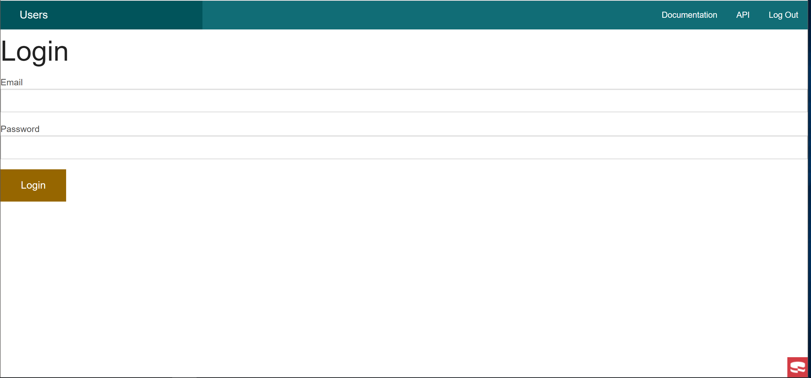
 
 **2. Admin**
  * Trang chủ sau khi đăng nhập
  
  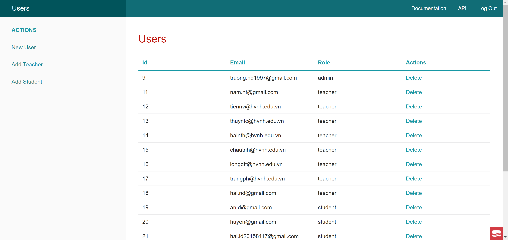
  
  * Thêm người dùng vào hệ thống
  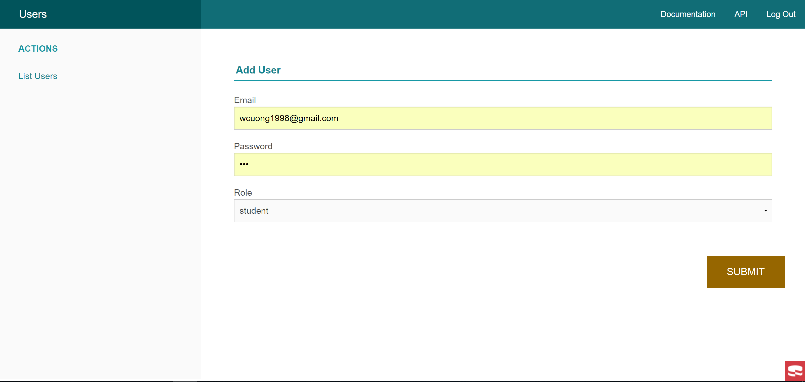
  
  * Thêm giáo viên
  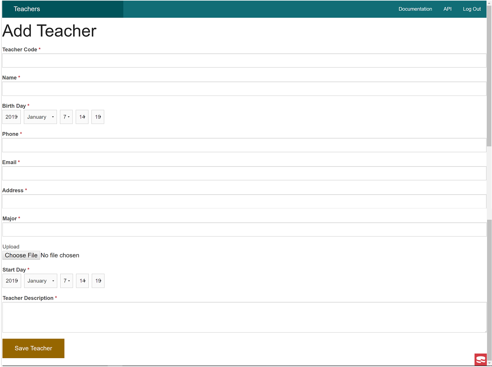
  
  * Thêm sinh viên
  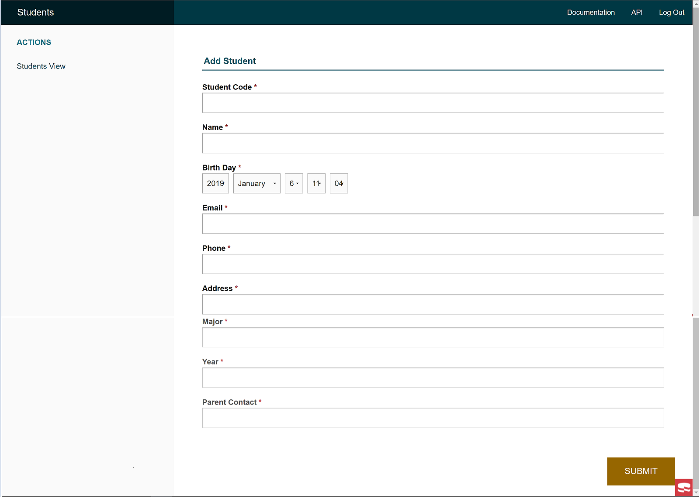
  
  **3. Giáo viên**
  
   * Trang chủ sau khi đăng nhập
   
   Nhập mã giáo viên để xem thông tin
   
   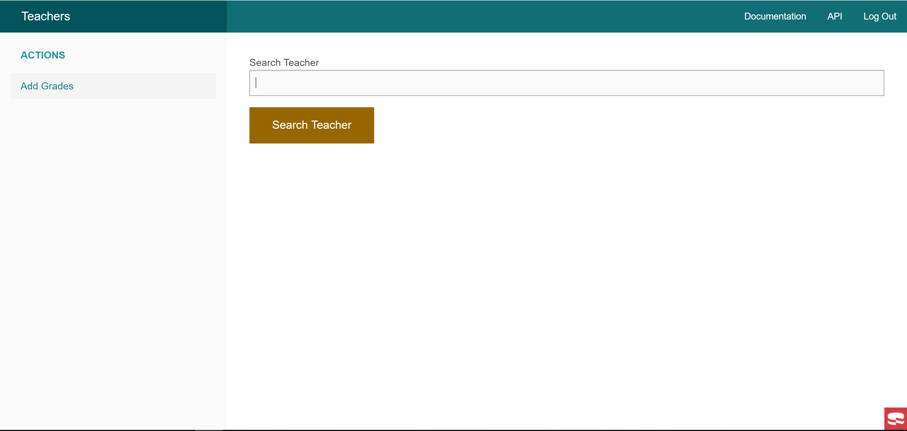
   
   * Xem thông tin giáo viên
   
   Sau khi nhập mã giáo viên sẽ chuyển sang trang thông tin của giáo viên đó
   
   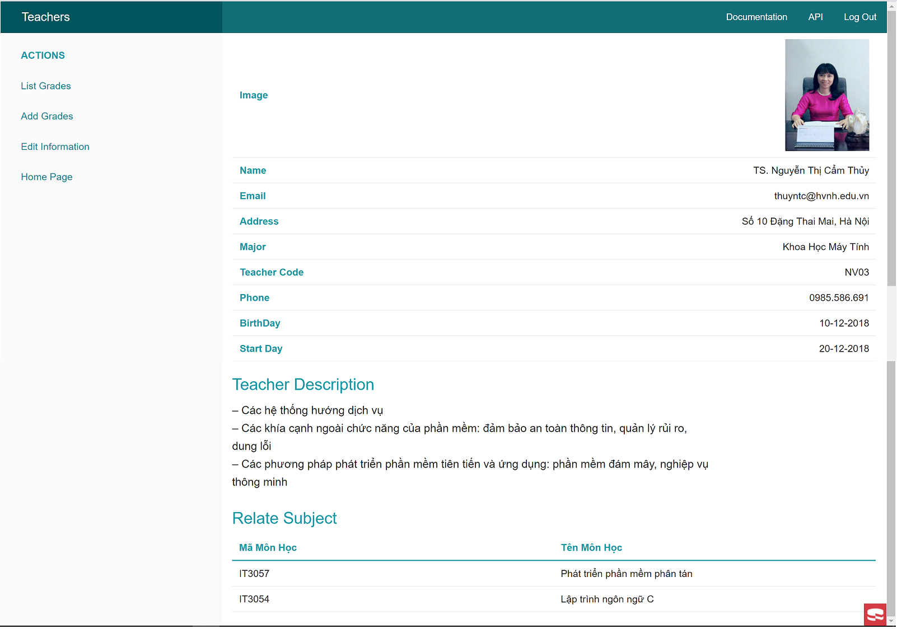
   
   ***sau đó giáo viên có thể chọn các chức năng của mình***
   
   * Sửa thông tin giáo viên
   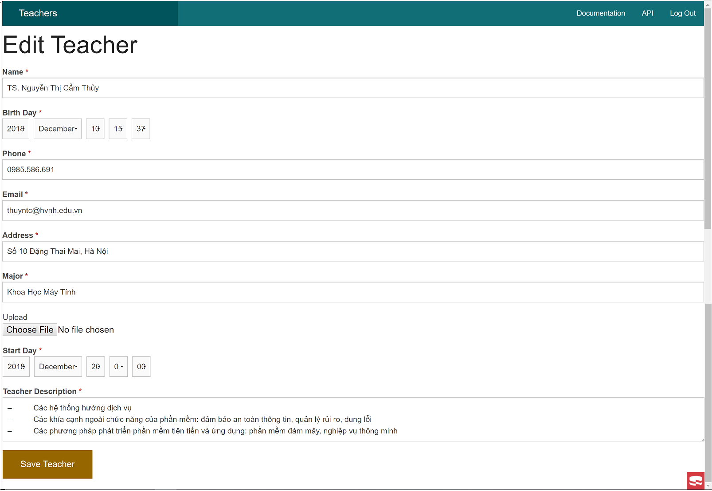
   
   * Thêm điểm
   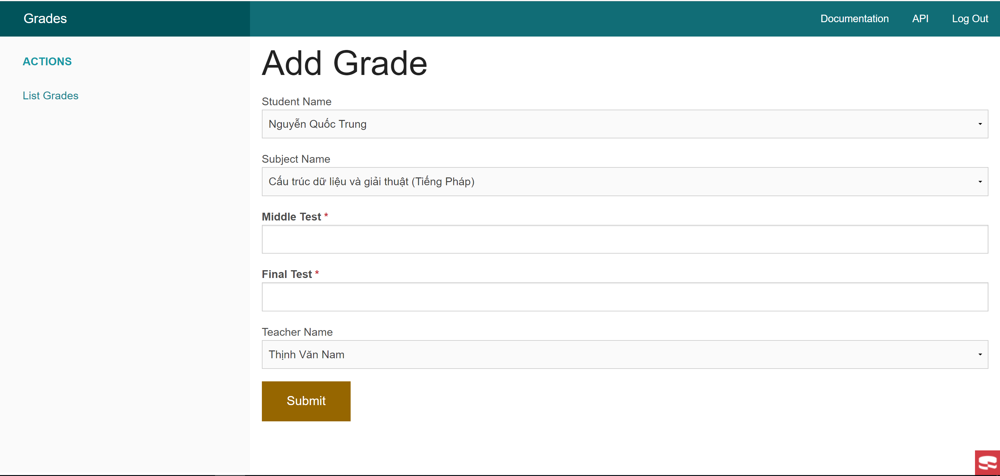
   
   * Xem danh sách điểm 
   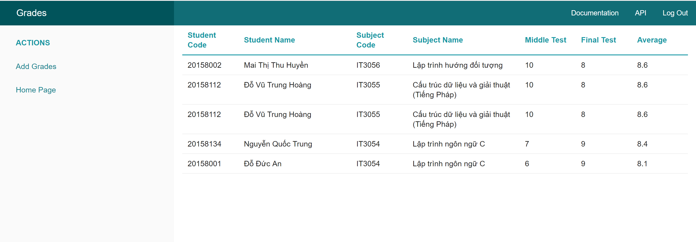
   
  **4. Sinh viên**
  
   * Trang chủ 
     
    Nhập mã sinh viên của mình vào ô search để xem thông tin cá nhân
    
   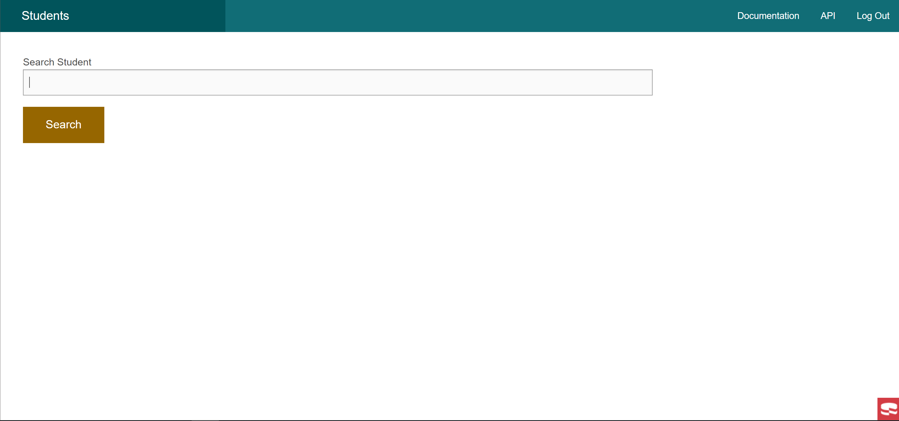
    
   * Xem thông tin sinh viên
    
   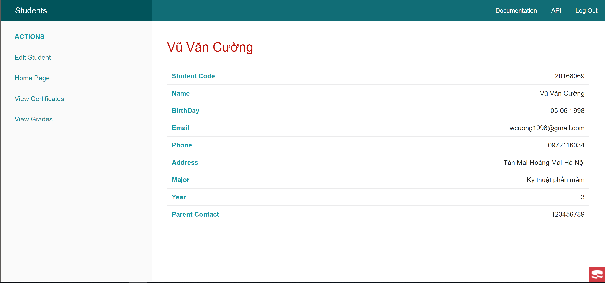
    
  ***sau đó chọn có thể chọn các chức năng***
   * Sửa thông tin sinh viên
    
   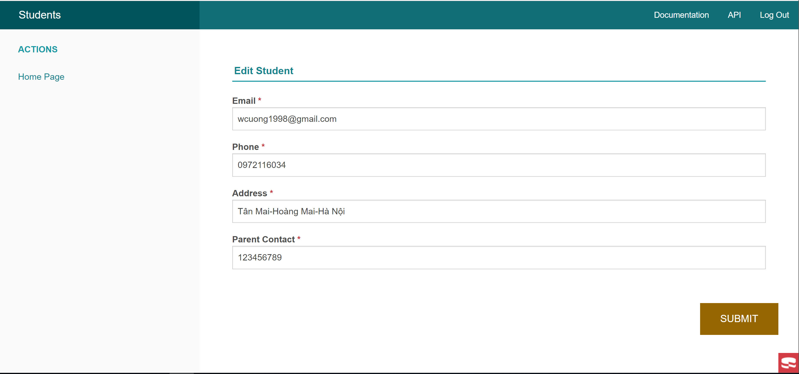
    
   * Xem điểm
    
   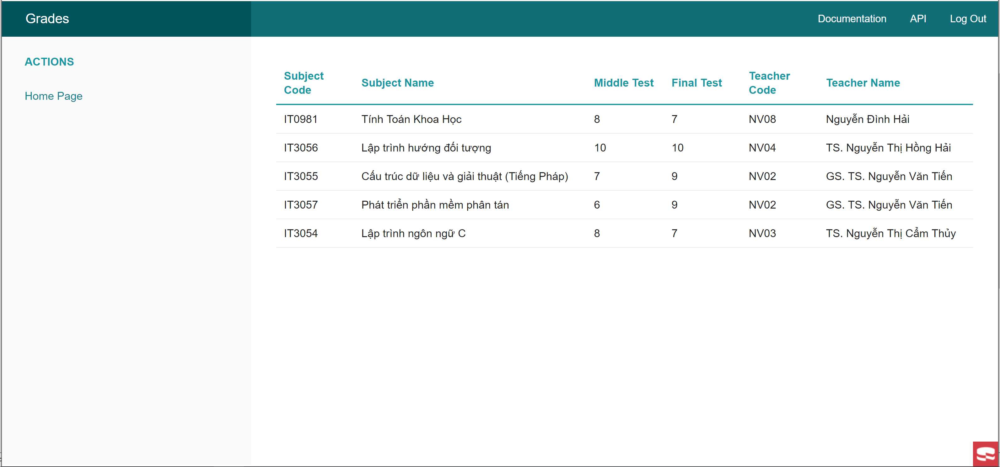
    
   * Xem bằng
    
   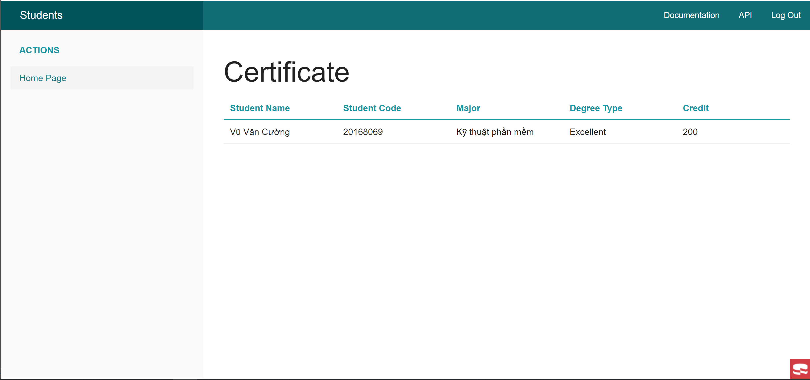
  

***
# Demo video

***

###      Để hoàn thành được project 1 chúng em xin trân thành cảm ơn thầy giáo/giảng viên Đào Thành Chung đã luôn hướng dẫn và giúp đỡ nhóm hoàn thành đề tài được giao.
